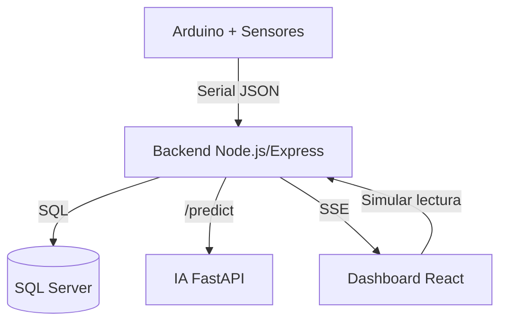

# AgriFlow

AgriFlow es una plataforma de riego inteligente desarrollada en el semillero de investigación SENA. Integra hardware, backend, IA y frontend para monitorear variables agroambientales y apoyar decisiones de riego con datos en tiempo real.

## Visión general

El proyecto combina sensores conectados a Arduino con un backend en Node.js, una capa de IA en Python y un dashboard web en React. El objetivo es optimizar el uso del agua, reducir desperdicios y facilitar el control operativo desde una interfaz clara y accesible.

## Funcionalidades clave

- Monitoreo en tiempo real vía SSE.
- Ingesta de lecturas desde sensores o simulación para pruebas.
- Almacenamiento de lecturas en SQL Server.
- Recomendación de riego con IA (reglas actuales y base para modelos).
- Dashboard con métricas, tendencias y estado del sistema.

## Arquitectura

- Hardware: Arduino Uno, sensores ambientales y relé de control.
- Backend: Node.js + Express, API, SSE, acceso a datos y orquestación de IA.
- IA: FastAPI en Python con endpoint `/predict`.
- Frontend: React + Tailwind con visualización en tiempo real.

## Diagrama de arquitectura



## Flujo de datos

1. Arduino envía lecturas por Serial o el frontend genera lecturas simuladas.
2. El backend persiste las lecturas y consulta el servicio IA.
3. El backend publica eventos en tiempo real vía SSE.
4. El frontend consume SSE y actualiza el dashboard.

## Estado del proyecto

| Componente | Estado | Detalle |
| --- | --- | --- |
| Hardware | Pendiente | Integración física con Arduino en fase de conexión. |
| Backend | Operativo | API, SSE y persistencia de lecturas. |
| IA | Operativa | Reglas básicas y endpoint `/predict`. |
| Frontend | Operativo | Dashboard y simulación de lecturas. |
| Datos | Simulados | Uso de simulación mientras se integran lecturas reales. |

## Estructura del repositorio

- `backend/`: API, SSE, servicios de lectura y conexión a SQL Server.
- `frontend/`: dashboard web y componentes UI.
- `ml/`: servicio IA con FastAPI.
- `docs/`: documentación técnica en Markdown.

## Requisitos

- Node.js (backend y frontend).
- Python 3.10+ (servicio IA).
- SQL Server (instancia y base de datos configuradas).

## Configuración

Copia `backend/.env.example` a `backend/.env` y ajusta los valores de `DB_*` y `ML_URL`. Si usas certificados propios en SQL Server, valida `DB_TRUST_SERVER_CERT` y `DB_ENCRYPT`.

### Variables de entorno principales (backend)

```env
PORT=3000
ML_URL=http://127.0.0.1:8001
DB_SERVER=localhost
DB_NAME=AgriFlowDB2
DB_DRIVER=msnodesqlv8
DB_INSTANCE=SQLEXPRESS
DB_TRUSTED_CONNECTION=true
```

## Ejecución local

1. IA: `cd ml`, `pip install -r requirements.txt`, `python -m uvicorn app:app --host 127.0.0.1 --port 8001`.
2. Backend: `cd backend`, `npm install`, `npm run dev`.
3. Frontend: `cd frontend`, `npm install`, `npm run dev`.
4. Abrir `http://localhost:5173`.

## Despliegue

1. Backend: `cd backend`, `npm install`, `node src/app/server.js`.
2. IA: `cd ml`, `pip install -r requirements.txt`, `python -m uvicorn app:app --host 127.0.0.1 --port 8001`.
3. Frontend: `cd frontend`, `npm install`, `npm run build` y publicar `frontend/dist` en un servidor estático.
4. Validación: Backend `http://localhost:3000/health`, SSE `http://localhost:3000/events`, IA `http://127.0.0.1:8001`.

## Base de datos

La base de datos mínima se compone de dos tablas:

| Tabla | Propósito |
| --- | --- |
| `Sensores` | Catálogo de sensores registrados. |
| `Lecturas` | Histórico de mediciones capturadas. |

El backend inicializa sensores base si no existen para garantizar datos de ejemplo.

## Simulación

Para pruebas y demos, el frontend puede generar lecturas simuladas y enviarlas al backend. Esto permite validar el dashboard sin depender del hardware en tiempo real.

## Documentación

- Documento completo: `docs/AgriFlow_Documentacion_Completa.md`
- Backend: `docs/backend.md`
- Frontend: `docs/frontend.md`
- Base de datos: `docs/database.md`
- IA (ML): `docs/ml.md`
- Ejecución local: `docs/runbook.md`

## Pantallazos

Agrega aquí los pantallazos del proyecto una vez finalizado el diseño.

| Vista | Archivo |
| --- | --- |
| Prototipo | `docs/screenshots/prototype.png` |
| Dashboard | `docs/screenshots/dashboard.png` |
| Lecturas | `docs/screenshots/readings.png` |
| IA | `docs/screenshots/ml.png` |

## Créditos

Equipo del semillero de investigación SENA. Agrega aquí los integrantes y roles del proyecto.


